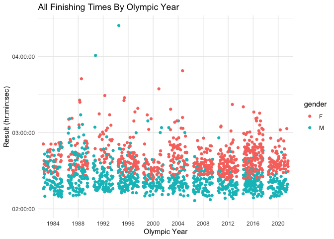

<!-- README.md is generated from README.Rmd. Please edit that file -->

# olympicmarathon 

<!-- badges: start -->

[](https://lifecycle.r-lib.org/articles/stages.html#experimental)
[](https://CRAN.R-project.org/package=olympicmarathon)
[](https://github.com/mflesaker/olympicmarathon/actions)
<!-- badges: end -->

`olympicmarathon` is an R package that contains historic data about
Olympic marathon competitors and functionality to work with the data.
Previously, data about Olympic marathons has been rather sparse, and
official data is usually published in PDF form which creates barriers to
performing analysis on it. This package aims to facilitate the viewing
and analysis of the data by compiling it into one place for easy access
and creating functionality for painless exploration. The data is
compiled from the [World Athletics
Website](https://www.worldathletics.org/) and
[OlympianDatabase.com](https://www.olympiandatabase.com/).

## Installation

You can install the current version of olympicmarathon from GitHub using
the following code:

``` r
devtools::install_packages("mflesaker/olympicmarathon")
```

## Load

Load the package with the following code:

``` r
library(olympicmarathon)
```

## Available Tables

-   `olympic_marathon`: data set of men’s and women’s marathon results
    from Olympic races 1984-2020

## Example: Basic Data Extraction

``` r
## Generate the winner of the 2020 Olympic Women's Marathon

olympic_marathon %>%
  dplyr::filter(gender == "F") %>%
  dplyr::filter(year == 2020) %>%
  dplyr::filter(rank == 1) %>%
  dplyr::pull(name)
#> [1] "Peres Jepchirchir"
```

## Example: Visualize Data

``` r
## Show all finishing times 1984-2020

times_over_time()
```



## Contributors

-   [Michelle Flesaker](https://github.com/mflesaker)
-   [Georgia Gans](https://github.com/georgiagans)
